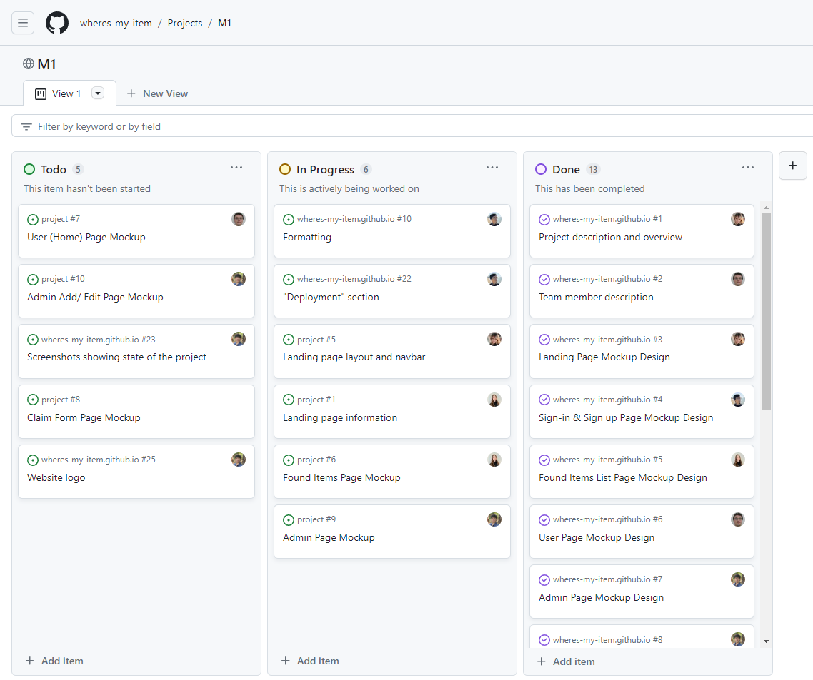

# Collaborating on a web application
## Overview
This project, Where's My Item, was a project in which I worked with four others to develop a web application. This website would emulate a lost and found service through a website. Through this website, visitors will be able to look through lost items that have been found, with a claim option if you find one of your items. There is also an admin login to add items, edit items, and review claim requests as needed. While the website is quite simple, it functions as it should, and I feel the simplicity could help attract users to the website. Below is a picture of our landing page when you initially enter the site:

For this project, we used Githubs Issue system to allocate tasks to each member. In addition to this, we managed the project using milestones to split up the development of the project. Our first milestone was for creating mockups and working on our home page. For this milestone, I created mockups for the sign-in and login page, worked on filling in information and the style of our project home page. For the second milestone where we worked on the functionality of our website, I worked on enhancing the user login as well as updating and adding to our project home page. For our third and final milestone, I finished enhancing the user sign-in and sign-up page and finalized the project home page. Below is a image of our a milestone and the issues we used:

Our <a href="https://wheres-my-item.github.io/">Project Home Page</a> 

While it can be accesed from the Project Home Page, here is the link to our <a href="https://github.com/orgs/wheres-my-item/repositories"/>Github repositories</a>.

Throughout the creation of this project, I was able to see the efforts of all our previous assignments pay off. Everything we had learned prior had led up to this final project of creating a webpage. From creating this webpage, I learned so much about creating websites and managing websites, project development, and project management. What I liked especially about this project was that this is something I never would've done without this class. Looking back at everything I learned, I realized how important this class was, and how every aspect of this project could be applied to future projects. This was truly a great project to work on and to have as a final assessment for this course.
